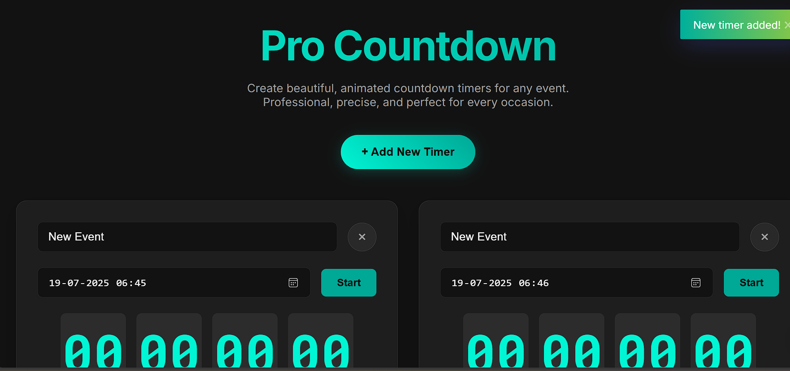

# Pro Countdown Timer

A sleek, modern, and feature-rich countdown timer application built with vanilla JavaScript, HTML, and CSS. This project provides a professional and highly interactive user experience for creating and managing multiple countdowns for any event.

---

## ✨ Features

- **Multiple Timers**: Add as many countdown timers as you need on a single page.
- **Sleek Dark UI**: A modern, professional dark theme that's easy on the eyes.
- **Smooth Animations**: Numbers update with a fluid slide-and-fade animation for a polished feel.
- **Interactive Controls**: Easily start, stop, and delete timers.
- **Event Naming**: Assign custom names to each timer for better organization.
- **Toast Notifications**: Get non-intrusive feedback for actions like adding a timer or when a countdown completes, powered by [Toastify.js](https://github.com/apvarun/toastify-js).
- **Audio Alerts**: A sound notification plays when a timer reaches zero or starts.
- **Professional Dialogs**: Clean and stylish confirmation dialogs for deleting timers, powered by [SweetAlert2](https://sweetalert2.github.io/).
- **Fully Responsive**: The layout adapts beautifully to all screen sizes, from large desktops to mobile phones.
- **No Dependencies**: Built with pure HTML, CSS, and JavaScript, with external libraries loaded via CDN for simplicity.

---

## 🚀 Getting Started

To run this project, you don't need any complex setup or build tools. Simply follow these steps:

1.  **Clone or Download the Repository**: Get the project files onto your local machine.
2.  **Ensure File Structure**: Make sure the `index.html`, `style.css`, and `script.js` files are all in the same directory.
3.  **Open in Browser**: Open the `index.html` file directly in your web browser (like Chrome, Firefox, or Edge).

That's it! The application will be up and running.

---

## 📂 File Structure

The project is organized into three main files:

.
├── index.html      # The main HTML file with the structure of the application.
├── style.css       # All the styles, animations, and responsive design rules.
└── script.js       # The JavaScript logic for all functionality.

---

## 🛠️ Technologies Used

-   **HTML5**: For the core structure and content.
-   **CSS3**: For all styling, including Flexbox, Grid, custom properties, and animations.
-   **Vanilla JavaScript (ES6+)**: For all the dynamic behavior and DOM manipulation.

### External Libraries (via CDN)

-   [**Google Fonts**](https://fonts.google.com/): For the 'Inter' and 'Roboto Mono' typefaces.
-   [**SweetAlert2**](https://sweetalert2.github.io/): For beautiful and responsive confirmation dialogs.
-   [**Toastify.js**](https://github.com/apvarun/toastify-js): For sleek, non-intrusive toast notifications.

---

## 📄 License

This project is open-source and available under the [MIT License](LICENSE).

---

## 🙏 Credits

A big thank you to the creators of the libraries that helped make this project's UI so professional:

-   **SweetAlert2**
-   **Toastify.js**
